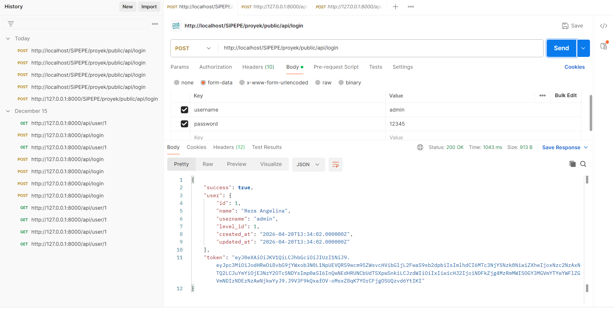
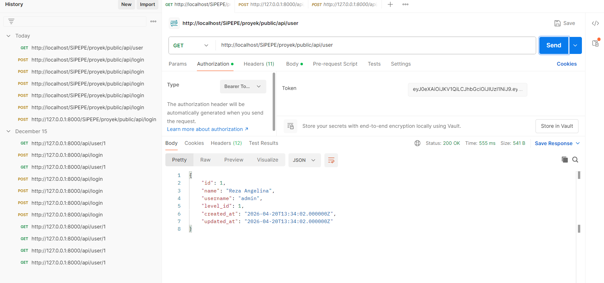

# SiPEPE ~ Sistem Pencatatan Penjualan
Saya sedang mengembangkan sebuah sistem untuk menunjang operasional UMKM Kerupuk Ananda Mojokerto.
Pada sistem ini, saya telah mengimplementasikan **RESTful API untuk autentikasi login** menggunakan Laravel dan JWT (JSON Web Token).

## 🔐 RESTful API Authentication (JWT)
### 📌 Endpoint Login
- **Method**: POST  
- **URL**: `/api/login`

### 📥 Request Body
```json
{
  "username": "admin",
  "password": "password"
}
```

### 📥 Response (Success)

Berhasil mendapatkan token JWT


### 📌 Endpoint Login
- **Method**: GET  
- **URL**: `/api/user`

### 📥 Authorization: Bearer <token>

### 📥 Response (Success)

Berhasil mengakses data user menggunakan token
